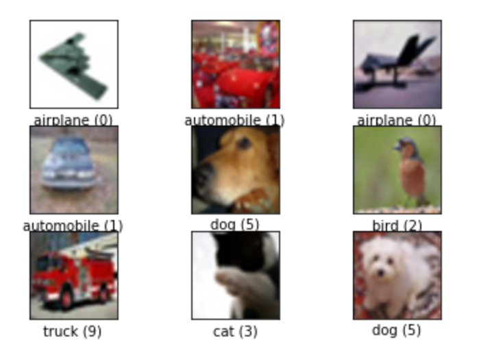
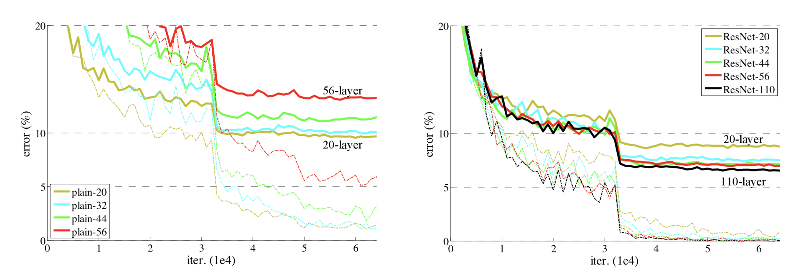
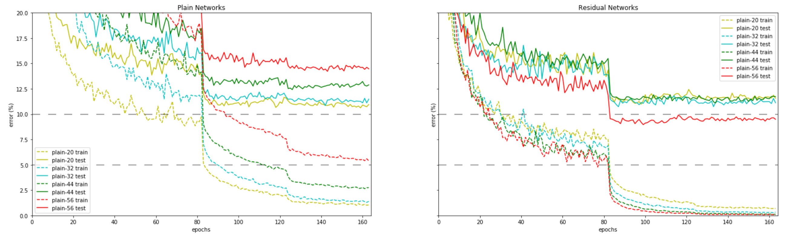

# Deep Residual Learning for Image Recognition: CIFAR-10, PyTorch Implementation

An implementation of the "ResNet" paper *Deep Residual Learning for Image Recogniton* [1]. This PyTorch implementation produces results within 1% of the authors' reported test error. 

The main training procedure is described as a jupyter notebook in `main.ipynb` viewable [here](https://nbviewer.jupyter.org/github/a-martyn/resnet/blob/master/main.ipynb).

The CIFAR-10 experiment from section 4.2 of the paper is reproduced. The goal is to classify tiny 32x32 pixel images into one of 10 classes. Some examples below. This implementation achieves 92.67% test set accuracy in this setting.



## Getting Started

### Prequesites

- Linux or MacOS
- Python 3
- CPU or NVIDIA GPU + CUDA CuDNN

### Installation

Clone this repo:

```
git clone https://github.com/a-martyn/resnet.git
cd resnet
```

Setup environment and install dependencies with pip:

```
python -m venv venv
source venv/bin/activate
pip install -r requirements.txt
```

Train the model! Launch jupyter notebooks and run `main.ipynb`:

```
jupyter notebook
```
- in Jupyter open `main.ipynb` and execute top-to-bottom


 ## Results from the original paper



Figure 6. (from original paper) Training on CIFAR-10. Dashed lines denote training error, and bold lines denote testing error. **Left**: plain networks. The error of plain-110 is higher than 60% and not displayed. **Right**: ResNets.

## Results from this implementation



A recreation of Figure 6. showing the results from this implementation for comparison. All annotations are matched. Epochs are used for x-axis where 1 epoch is equivalent to 391 iterations in Figure 6. 110 layer networks are not tested.

## Best test error

| Architecture | #layers | % Test Error (original paper) | % Test Error (this implementation)  |
| --- | --- | --- | --- |
| Plain Net | 20 | 9.5\* | 9.5 |
| Plain Net | 32 | 10\* | 9.92 |
| Plain Net | 44 | 12\* | 11.35 |
| Plain Net | 56 | 13.5\* | 12.76 |
| ResNet | 20 | 8.75 | 8.0 |
| ResNet | 32 | 7.51 | 7.51 |
| ResNet | 44 | 7.17 | 7.38 |
| ResNet | 56 | 6.97 | 7.33 |

\* approximate readings from Figure 6.

Classification error on the CIFAR-10 test set. The lowest test error achieved across all training epochs is reported. The best test error reproduced for plain networks is approximately equivalent to the original paper and 0.36% higher than cited in the original paper for resnets. For the 20-layer resnet we observe a test error 0.75% below that reported in the original paper.

## Summary

The authors report that residual layers enable deep networks, with more than 20 layers, to outperform shallower networks. That observation is reproduced here with the deepest 56-layer residual network outperforming all other networks tested, whilst the equivalent 56 layer plain network performed the worst.

The original paper also reported that residual layers improved the performance of smaller networks, for example in Figure 6. the 20-layer ResNet outperforms its 'plain' counterpart. That result is also reproduced here with the residual 20-layer network outperforming the plain network by 1.5%.

## Implementation notes

1. **Data Augmentation**: The authors describe a 'random crop' whilst referencing a paper [2] that describes 'corner cropping'. This could be interpreted as either of the following:
    - `torchvision.transforms.RandomCrop`: Crop the given PIL Image at a random location (used here).
    - `torchvision.transforms.FiveCrop`: Crop the given PIL Image into four corners and the central crop

2. **Zero Padding**: The paper specifies kernel size of 3x3 with stride of 1 for most convolutions in the architectures. Where this occurs it is stated that the feature map size is maintained, yet this would not be possible unless a zero-padding of 1 pixel is accounted for during convolution. This implementation therefore assumes a zero padding of 1.

3. **Subsampling**: The architecture described includes subsampling to decrease the feature map size from 32x32 to 16x16 to 8x8, with filter counts increasing 16 to 32 to 64 respectively. A kernel size of 3x3 pixels with a stride of 2 achieves this. This convolution does not exactly fit into any even sized feature map.

4. **Downsampling Shortcuts**: When a residual block downsamples its input the feature map size is halved in both dimensions whilst the number of filters is doubled. This means that the residual shortcut cannot simply add the block's input matrix to the its output because the dimensions do not match. Some form of 'downsampling' is required. For the CIFAR-10 experiment the authors describe linear mapping to perform this downsampling (see 'option A' section 3.3). The important characteristic here is that the downsampling procedure should add no additional learnable parameters. This implementation achieves this with a 2d average pooling of kernel size 1 and stride 2, effectively dropping every other pixel, which results in feature maps halved in each dimension. We then need to double the number of filters by concatenating a duplicate of the downsampled feature maps multiplied by zero. This seems crude because half of the input information is simply ignored by the residual shortcut. Would performance be improved by reshaping the input to match the output dimensions? Some investigation is provided here [4].

5. **Batch Normalisation**: batch normalisation with running estimates of mean and standard deviation  is critical to reproducing the original results. This yields a 2-3% reduction in test error, and interestingly without this feature residual shortcuts provide no improvement for the smallest 20-layer network.

## References

- [1] K. He, X. Zhang, S. Ren, and J. Sun.  Deep residual learning for image recognition. In CVPR, 2016.
- [2] C.-Y. Lee, S. Xie, P. Gallagher, Z. Zhang, and Z. Tu. Deeply-supervised nets. arXiv:1409.5185, 2014.
- [3] Nitish Srivastava and Geoffrey Hinton and Alex Krizhevsky and Ilya Sutskever and Ruslan Salakhutdinov. Dropout: A Simple Way to Prevent Neural Networks from Overfitting. Journal of Machine Learning Research, 2014
- [4] K. He, X. Zhang, S. Ren, and J. Sun.  Identity mappings in deep residual networks. In ECCV, 2016
